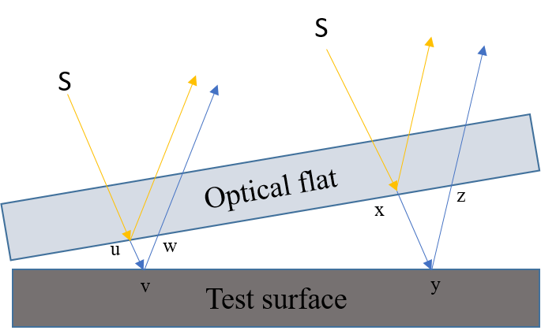

## Introduction

<b>Discipline | <b> Mechanical Engineering 
:--|:--|
<b> Lab | <b> ** Metrology and Measurement Lab**
<b> Experiment|     <b> **Study and use of Optical flats and Experiment 6**

### About the Experiment

Optical flats are precision optical components used for measuring the flatness of surfaces. These devices are crucial in quality control and precision manufacturing processes, for e.g., inspecting critical components like mirrors, lenses, semiconductor wafers, etc.

Generally, Optical flats are used in the metrology and measurements laboratories to determine the flatness of the slip gauges. 

Fig. 1 Use of Optical flats and test surface           

<b>Subject matter expertise | <b> **Dr. Poonam Sundriyal**
:--|:--|
<b> Institute | <b>  **Indian Institute of Technology Kharagpur**
<b> Email id|     <b>  **psundriyal@mech.iitkgp.ac.in**
<b> Department |  **Department of Mechanical Engineering**
<b>Webpage| <b> [https://www.iitkgp.ac.in/department/ME/faculty/me-psundriyal](https://www.iitkgp.ac.in/department/ME/faculty/me-psundriyal)

<b>Subject matter expertise | <b> **Dr. Siddharth Tamang**
:--|:--|
<b> Institute | <b>  **Indian Institute of Technology Kharagpur**
<b> Email id|     <b>  **stamang@mech.iitkgp.ac.in**
<b> Department |  **Department of Mechanical Engineering**
<b>Webpage| <b> [https://www.iitkgp.ac.in/department/ME/faculty/me-stamang](https://www.iitkgp.ac.in/department/ME/faculty/me-stamang)

<b>Subject matter expertise | <b> **Prof. Cheruvu Siva Kumar**
:--|:--|
<b> Institute | <b>  **Indian Institute of Technology Kharagpur**
<b> Email id|     <b>  **kumar@mech.iitkgp.ac.in**
<b> Department |  **Department of Mechanical Engineering**
<b>Webpage| <b> [https://www.iitkgp.ac.in/department/ME/faculty/me-kumar](https://www.iitkgp.ac.in/department/ME/faculty/me-kumar)

### Contributors List

SrNo | Name | VLabs Developer or Integration Engineer | Designation | Department| Institute
:--|:--|:--|:--|:--|:--|
1 | **Piyali Chattopadhyay** | Developer  | Project Scientist | Department of Mechanical Engineering | IIT Kharagpur | 
2 | **Vishal Mishra** | |Research Scholar | Department of Mechanical Engineering | IIT Kharagpur | 
3 | **Subhasis Mahata** | Integration Engineer | Senior Project Scientist | Department of Mechanical Engineering | IIT Kharagpur |