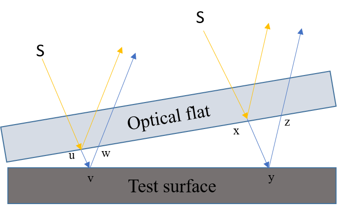

## Introduction

<b>Discipline | <b> Mechanical Engineering 
:--|:--|
<b> Lab | <b> ** Metrology and Measurement Laboratory**
<b> Experiment|     <b> **Study and use of Optical flats and Experiment 6**

### About the Experiment

Optical flats are precision optical components used for measuring the flatness of surfaces. These devices are crucial in quality control and precision manufacturing processes, for e.g., inspecting critical components like mirrors, lenses, semiconductor wafers, etc.

Generally, Optical flats are used in the metrology and measurements laboratories to determine the flatness of the slip gauges. 

<b>Fig. 1 Use of Optical flats and test surface</b>          

