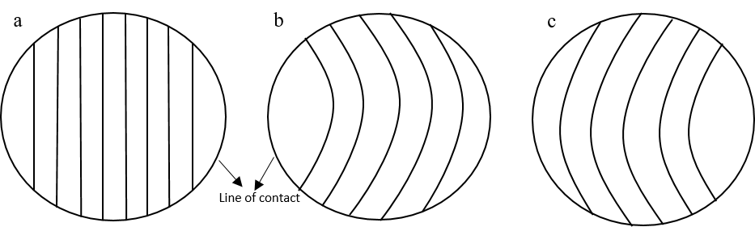
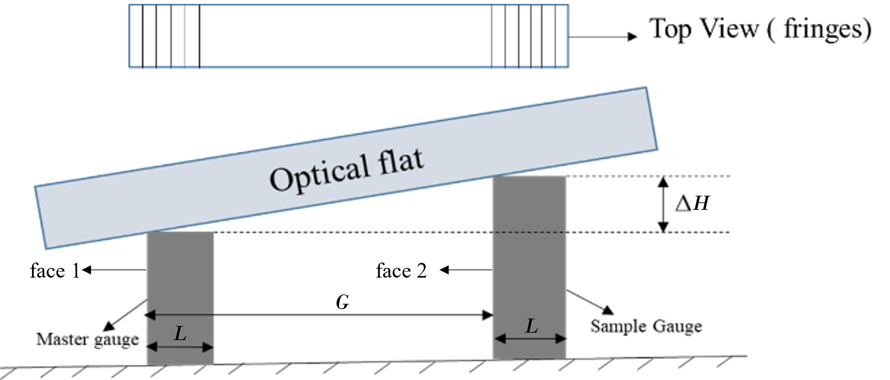

## Theory

Optical flats are precision optical components used for measuring the flatness of surfaces. These devices are crucial in quality control and precision manufacturing processes, for e.g., inspecting critical components like mirrors, lenses, semiconductor wafers, etc. These optical flats are usually made of polished glass with high-quality coatings. Its thickness ranges from 8 to 10 mm, and its diameter ranges from 25 to 300 mm. Its precision is due to its perfect flatness and ability to form interference patterns when placed above another flat surface. Interference patterns are created when light reflects off two surfaces- the reference surface and the test surface. The resulting interference pattern reveals the deviations in the flatness of the test surface.

When two flat surfaces, an optical flat, and a test surface, come in contact, a thin air gap is formed between them due to microscopic surface irregularities. When a monochromatic light (sodium vapour lamp having wavelength, &lambda; ~ 590 nm) wave encounters an optical flat, it is partially transmitted and partially reflected. These two components of the wavefront then travel different paths. The interference between the reflected and transmitted waves results in a pattern of alternating bright and dark fringes, known as interference fringes. When the distance travelled by the light between the optical flat and the test surface is an odd multiple of (&lambda;/2) then destructive interference occurs. 

<b>Fig. 1 Use of Optical flats and test surface</b>

In Fig. 1, the distance travelled by light wave between the optical flat and test surface at two different locations is (‘uvw’ = &lambda; / 2 and ‘xyz’ = 3 &lambda; / 2) is an odd multiple of &lambda; / 2 and thus destructive interference will occur forming dark fringes. Based on the level of flatness of the test surfaces, the orientation of these dark and bright fringes will differ. 

<b>Fig. 2  a. Regular Fringes  b. Convex fringes  c. Concave fringes</b>

Fig. 2 shows different fringes for different test surfaces. When the test surface is perfectly flat, then regular fringes are formed as shown in Fig. 2a, in case of curved surfaces two different types of fringe orientation can be observed. If the surface is convex and high in centre, then fringes are curved and away from line of contact as shown in Fig. 2b and if the surface is concave and low in the centre then fringes are curved and towards the line of contact as shown in Fig. 2c.

Generally, Optical flats are used in the metrology and measurements laboratories to determine the flatness of the slip gauges. If the variation in the height between the master gauge and the sample gauge is not within the tolerance limit, then those slip gauges are discarded and cannot be used for precision measurements. This difference in height (&Delta;H) can be calculated by using optical flat as shown in Fig. 3 below. 
				

<b>Fig. 3 Optical flat as comparator</b>

In Fig. 3, two gauges of width, ‘L,’ and the distance between face 1 and face 2 is G. An optical flat is placed on both gauges, and &Delta;H is calculated using the following expression.

$$\Delta H = (n \lambda / 2)(G / L) \tag{1}$$

n = total no. of fringes

&lambda; = wavelength of the light

								